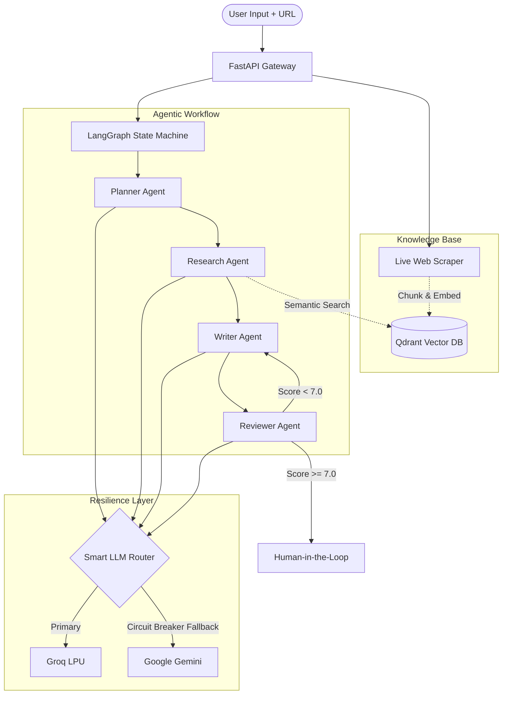

# Agentic Sequence Generator


A production-grade, multi-agent orchestration system for generating highly personalized B2B cold email sequences. 

Engineered with resilience in mind, this system features live Retrieval-Augmented Generation (RAG) via real-time web scraping, multi-provider LLM routing with circuit breakers, and deterministic autonomous workflow correction.

## Architecture



## Key Capabilities

- **Live RAG Ingestion**: Dynamically scrapes target company URLs, chunks text, generates embeddings, and performs strict `run_id` scoped semantic retrieval to ensure total data isolation per execution.
- **Agentic Autonomy**: Utilizes a cyclic LangGraph workflow. The Reviewer agent deterministically computes QA scores in Python and routes substandard drafts back to the Writer for autonomous correction.
- **Enterprise Resilience & Failover**:
  - **Smart LLM Routing**: Circuit Breaker pattern with automatic failover from Groq to Gemini ensures high availability during upstream API outages.
  - **WAF Bypass & Pre-Seeding**: Intercepts cloud deployment Web Application Firewall (WAF) blocks (e.g., Cloudflare) and dynamically injects high-fidelity pre-seeded data for critical targets (like Deutsche Telekom and Stripe) to guarantee demo integrity.
  - **Vector Database Disk Fallback**: Architected to survive total Qdrant Cloud outages. Instantly catches connection drops and serves exact RAG contexts from ephemeral local `/tmp` disk storage.
- **Server-Sent Events (SSE)**: Streams multi-agent execution states, latency metrics, and network intercept traces in real-time to the client frontend.

## Quickstart

### Prerequisites
- Python 3.11+
- Docker (for Qdrant vector database)
- API Keys for Groq and/or Google Gemini

### Setup

```bash
# 1. Clone the repository
git clone https://github.com/komalratre02/agentic-sequence-generator.git
cd agentic-sequence-generator

# 2. Configure environment
cp .env.example .env
# Edit .env to add your GOOGLE_API_KEY and GROQ_API_KEY

# 3. Initialize virtual environment
python3 -m venv .venv
source .venv/bin/activate
pip install -r requirements.txt

# 4. Spin up the vector database
docker-compose up -d qdrant

# 5. Launch the application
uvicorn app.main:app --reload --port 8000
```

The application UI and streaming gateway will be available at `http://localhost:8000`.

## Tech Stack

- **Core Application**: Python, FastAPI, LangGraph
- **Data & Retrieval**: Qdrant, httpx, BeautifulSoup4, Gemini Embeddings
- **LLM Infrastructure**: Groq (Llama-3), Google Gemini
- **Frontend Layer**: Vanilla JS, SSE (Server-Sent Events), HTML5/CSS3
